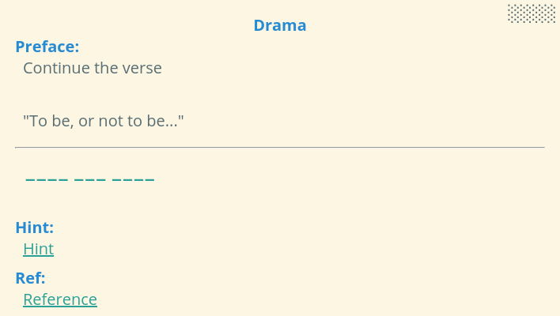
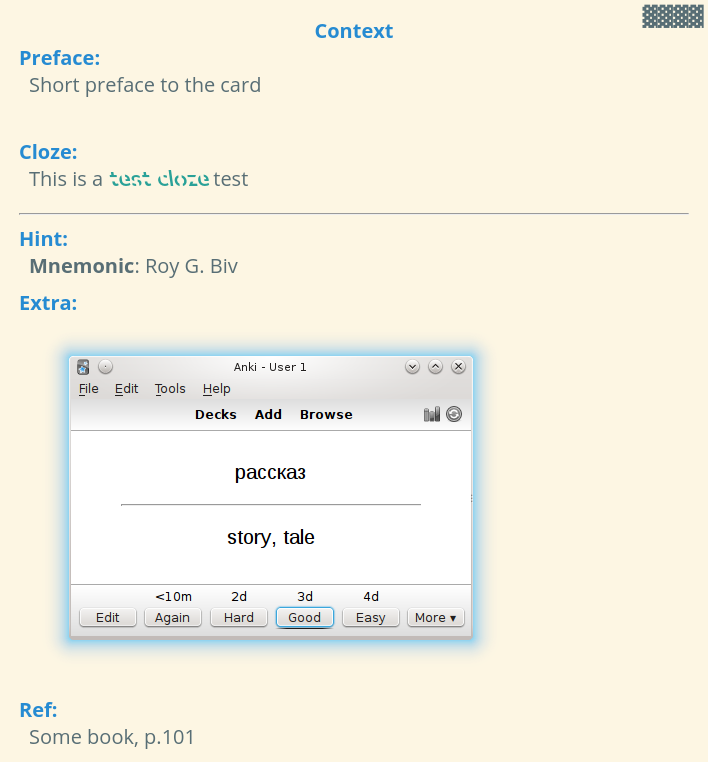

# anki-templates

This is a small collection of [Anki](https://apps.ankiweb.net/) card templates I use in my decks. They are made to be consistent and to provide a sane default for most of my usecases. To avoid eyestrain, I opted for the cool [Solarized](https://ethanschoonover.com/solarized/) color palette.

Feel free to use and adapt them to your needs!

## Requirements

* Open Sans - default font for the cards, falls back to generic sans-serif font
* (Optional) [Sans Forgetica](https://sansforgetica.rmit/) - used for most answers, falls back to Open Sans
* (Optional) [Cloze Overlapper Add-on](https://ankiweb.net/shared/info/969733775) - used only for the overlapping clzoe cards. For Anki 2.1, you will need to [build it](https://github.com/glutanimate/cloze-overlapper#building) yourself.

## Installation

To add a template, simply create a new note type with the fields from  its `fields.txt` and copy the contents of `front.html`, `back.html` and `style.css` to the corresponding fields.

**Note:** If you are using *Cloze Overlapper*, you also need to add your card type to the add-on settings in `Tools -> Cloze Overlapper Options -> General -> Names` (comma separated values).

## Style

All cards use the same style from `style.css`.

## Fields

Depending on the type, cards have different fields for questions, answers and clozes. However, all of them, have the following **optional** fields:

* **Context** - some title for the card
* **Hint** - a short toggleable hint that is show on the front
* **Reference** - reference field (eg. book, page, etc) - displayed as a hint on the front as well
* **Extra** - extra context information to be displayed on the back only

## Cards

### Freeform

Has a `Text-Front` and a `Text-Back` field. 

**Front**

**Back**

### Q&A

Has `Question` and `Answer` fields.

**Front**

**Back**

### Cloze

Has a `Cloze` field.

**Front**

**Back**

### Overlapping Cloze

To comply with the requirements of the add-on the cloze goes in the `Original` field.

**Front**

**Back**

## Copyright

*Copyright © 2020 - Nichita Uțiu*

This repository is licensed under the MIT License.